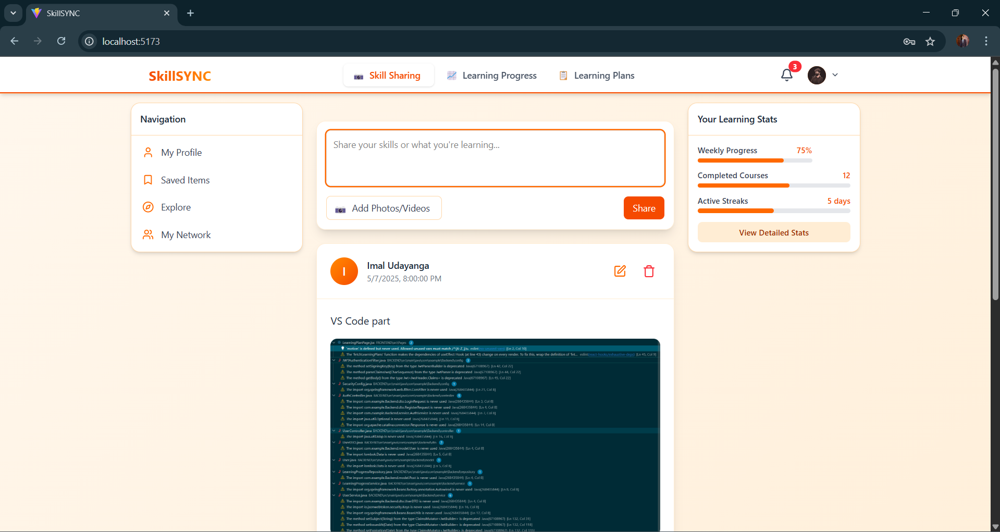
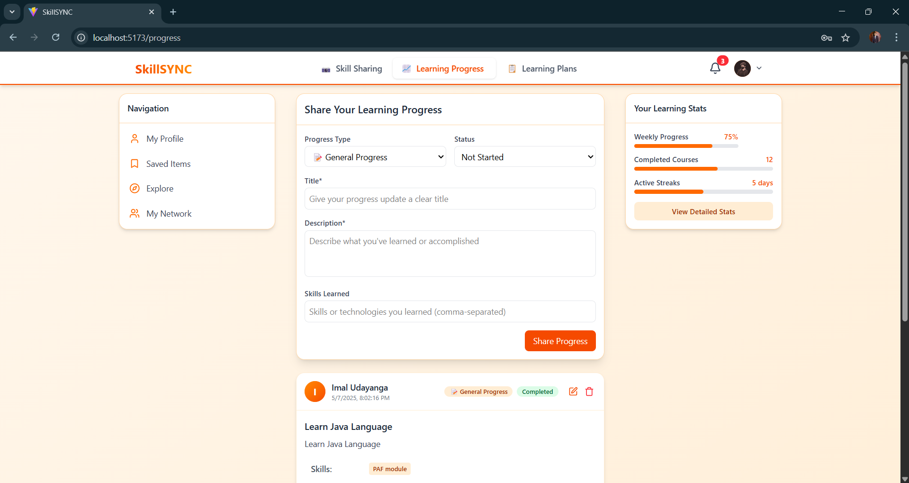

# 🚀 Skill-Share

🎓 **3rd Year 1st Semester PAF Module Group Project**

---

## 📌 Project Overview

**Skill-Share** is a dynamic Skill-Sharing & Learning Platform designed to empower individuals to share their knowledge and learn from others. Whether you're passionate about **coding**, **cooking**, **DIY crafts**, or **photography**, our platform enables you to:

- 📷 Create **media-rich posts** to showcase your expertise  
- 🗂️ Build and follow **structured learning plans**  
- 📈 Track your **learning progress**  
- 💬 Interact with others through **likes, comments, and follows**

---

## 💡 Features

- 🔧 **Skill Categories**: Coding, Cooking, DIY, Photography, and more!
- 📝 **Post Creation**: Upload text, images, videos
- 📚 **Learning Plans**: Create step-by-step guides
- 🔄 **Progress Tracker**: Monitor what you've completed
- ❤️ **Community Engagement**: Like, comment, follow other learners

---

## 🖼️ Screenshots

| Home Page | Learning Plan | Skill Post |
|----------|----------------|------------|
|  |  | 

> 📝 *Make sure your images are stored in `assets/images/` or update the path accordingly.*

---

## 🛠️ Tech Stack

- **Frontend**: React.js
- **Backend**: Spring Boot (Java)
- **Database**: MySQL / MongoDB
- **Tools**: GitHub, VS Code, Postman

---

## 👥 Team Members

- [Opatha Vithana V.L.T]
- [Danthanarayana D D A M]
- [Keenavinna K A I U]
- [Kodikara K A S S]

---

## 📁 Folder Structure

```bash
skill-share/
│
├── client/               # React frontend
├── server/               # Spring Boot backend
├── assets/               # Screenshots and images
│   └── images/
│       ├── home.png
│       ├── learning-plan.png
│       └── skill-post.png
├── README.md             # Project documentation
└── .gitignore
